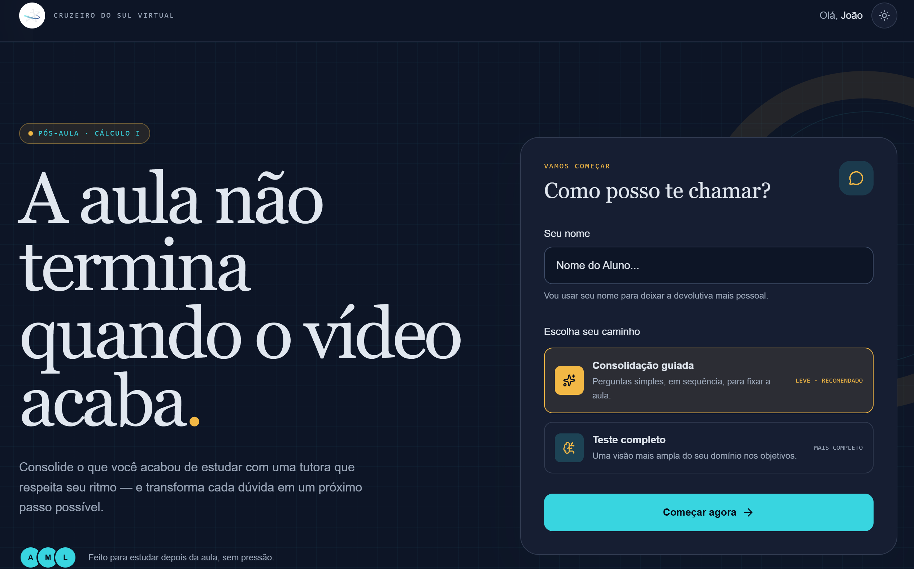
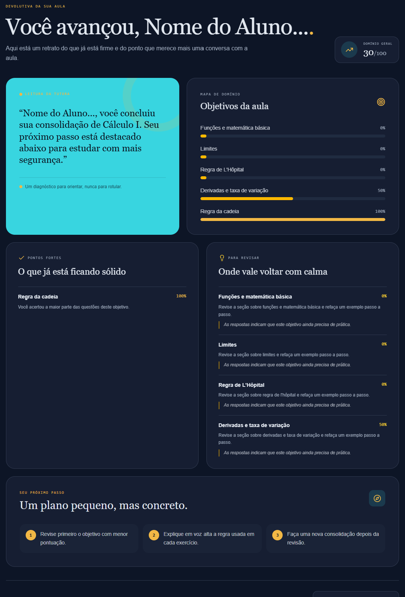
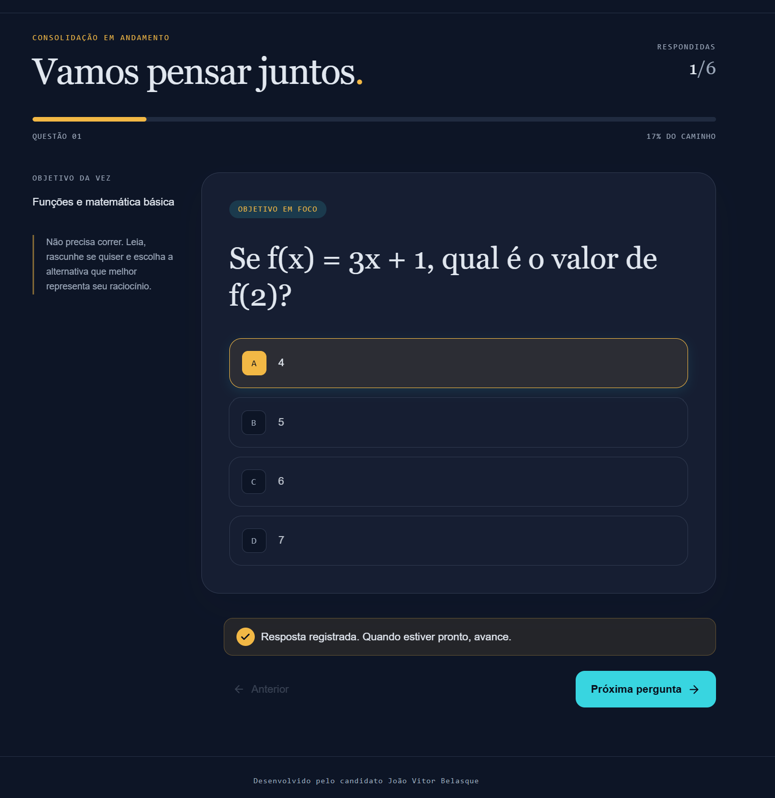
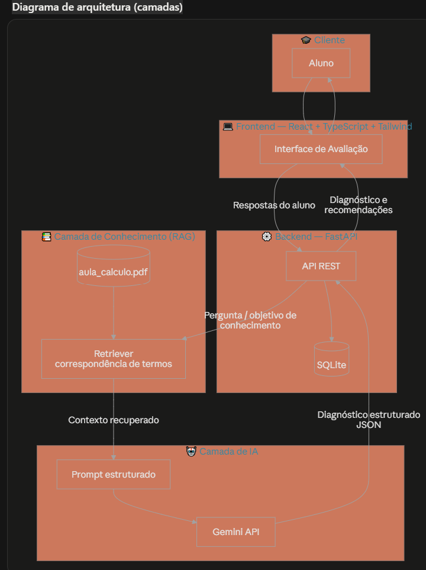
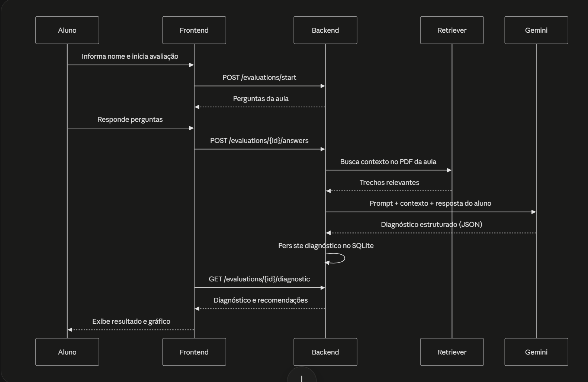
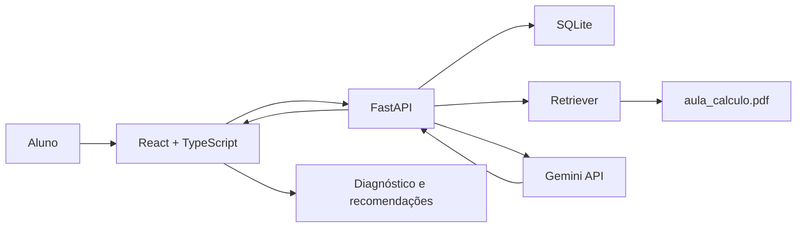

# Consolida Cálculo I — Case Engenharia de IA | Cruzeiro do Sul
     

Aplicação de **consolidação de aprendizagem baseada em Inteligência Artificial Generativa**, desenvolvida como solução para o desafio técnico de Engenharia de IA da Cruzeiro do Sul.

A aplicação utiliza o conteúdo da disciplina de **Cálculo I** como contexto para avaliar a compreensão do aluno após uma aula, identificar objetivos de conhecimento dominados ou que necessitam de revisão e gerar recomendações personalizadas de aprendizagem.

---

## 🎯 Desafio proposto
 
O desafio consiste em utilizar uma aula de Cálculo I fornecida pela Cruzeiro do Sul como contexto para desenvolver pelo menos um dos seguintes casos:

1. **Nivelamento** — identificar os pré-requisitos necessários para compreender a aula e verificar se o aluno possui esses conhecimentos.
2. **Consolidação de aprendizagem** — avaliar a compreensão do aluno após a aula, diagnosticar os conhecimentos dominados e recomendar conteúdos para revisão.
3. **Memorização** — utilizar flashcards adaptativos para reforçar conceitos que o aluno ainda não domina.

### Case escolhido: Consolidação de aprendizagem

Para este projeto foi escolhido o **Case 2 — Consolidação de aprendizagem**.

A escolha foi feita porque esse cenário permite demonstrar um fluxo completo de aplicação de IA generativa: ingestão de conhecimento, recuperação de contexto, interação com o aluno, avaliação das respostas, estruturação do resultado e geração de uma devolutiva personalizada.

---

# 💡 Problema

Após uma aula, o aluno pode ter a sensação de que compreendeu o conteúdo, mas ainda apresentar dificuldades em determinados conceitos.

Em um ambiente educacional com milhares de alunos, realizar uma análise individualizada de cada estudante manualmente pode ser difícil de escalar.

A proposta deste projeto é utilizar IA para auxiliar nesse processo, transformando as respostas do aluno em um **diagnóstico individual de aprendizagem**.

---

# 🚀 Solução

O **Consolida Cálculo I** conduz o aluno por uma avaliação baseada no conteúdo da aula e utiliza IA generativa para analisar suas respostas.

O fluxo principal é:

```text
Aluno
  ↓
Identificação do aluno
  ↓
Perguntas sobre o conteúdo da aula
  ↓
Respostas do aluno
  ↓
Recuperação de contexto do material de Cálculo I
  ↓
LLM / Agente de IA
  ↓
Análise das respostas
  ↓
Diagnóstico por objetivo de conhecimento
  ↓
Recomendações personalizadas
```

O resultado permite identificar, por exemplo:

* conceitos dominados;
* conceitos parcialmente compreendidos;
* conceitos que precisam de revisão;
* recomendações de estudo;
* desempenho geral do aluno.

A aplicação também apresenta uma visualização gráfica do desempenho.

---

# 🧠 Inteligência Artificial Generativa

A aplicação utiliza um modelo de linguagem generativo para realizar a análise das respostas e produzir o diagnóstico.

O modelo não é utilizado apenas como um chatbot. Ele faz parte de um fluxo estruturado de avaliação no qual recebe:

* contexto recuperado da aula;
* objetivo de conhecimento;
* pergunta apresentada ao aluno;
* resposta fornecida pelo aluno;
* instruções para classificação e geração do diagnóstico.

A resposta da IA é estruturada para que o backend possa processar os resultados e apresentá-los de forma consistente na aplicação.

---

# 🤖 Por que Gemini?

Foi utilizado o **Google Gemini através de API** como modelo de linguagem do protótipo.

A escolha considera principalmente aspectos técnicos e de prototipação:

### 1. Integração via API

O Gemini disponibiliza acesso programático aos modelos por API, permitindo integrar a capacidade de geração de linguagem diretamente ao backend da aplicação.

Isso possibilita separar a camada de aplicação da camada de modelo, permitindo que o modelo seja substituído futuramente sem a necessidade de reconstruir toda a aplicação.

### 2. Adequação ao caso de uso

O projeto necessita principalmente de:

* compreensão de texto;
* análise de respostas;
* geração de perguntas;
* geração de recomendações;
* resposta estruturada;
* utilização de contexto fornecido pela aplicação.

Essas capacidades são compatíveis com o cenário proposto.

### 3. Prototipação e custo

Para um desafio técnico, é importante conseguir desenvolver e validar a solução sem gerar custos desnecessários durante a etapa de prototipação.

A utilização do Gemini permitiu construir e testar a solução utilizando acesso por API dentro das condições disponíveis para desenvolvimento.

O critério de escolha, entretanto, não está limitado ao custo. A utilização da API também permite demonstrar experiência prática com integração de **modelos generativos disponíveis no mercado**.

### 4. Arquitetura desacoplada

A aplicação foi construída de maneira que a camada de inteligência não fique fortemente acoplada à interface.

Dessa forma, em uma evolução do projeto, seria possível avaliar diferentes modelos e provedores, como modelos disponibilizados por diferentes plataformas de IA generativa, comparando aspectos como:

* qualidade das respostas;
* latência;
* custo por requisição;
* capacidade de seguir instruções;
* contexto suportado;
* confiabilidade das respostas;
* desempenho na avaliação dos objetivos de conhecimento.

Essa abordagem permite tratar o modelo de IA como um componente substituível da arquitetura.

---

# 📚 RAG — Retrieval-Augmented Generation

Para evitar que o modelo dependa exclusivamente de seu conhecimento prévio, o projeto utiliza uma abordagem de **Retrieval-Augmented Generation (RAG)**.

O material da aula de Cálculo I é utilizado como fonte de conhecimento.

O fluxo simplificado é:

```text
Aula de Cálculo I
       ↓
Extração do conteúdo do PDF
       ↓
Recuperação dos trechos relevantes
       ↓
Contexto recuperado
       ↓
Prompt + contexto
       ↓
Gemini
       ↓
Resposta estruturada
```

Atualmente, o protótipo utiliza **PyMuPDF** para extração do conteúdo do PDF e um mecanismo de recuperação baseado em correspondência de termos para selecionar os trechos relevantes.

Essa abordagem foi escolhida pela simplicidade e adequação ao tamanho do material utilizado no desafio.

### Evolução possível do RAG

Em uma aplicação de produção, o mecanismo poderia evoluir para uma arquitetura mais robusta utilizando:

* chunking semântico;
* identificadores de documentos;
* metadados por seção;
* embeddings;
* banco de dados vetorial;
* reranking;
* avaliação automática da qualidade da recuperação.

---

# 🏗️ Arquitetura



### Componentes

**Frontend**

* React
* TypeScript
* Tailwind CSS

**Backend**

* Python
* FastAPI

**IA**

* Google Gemini API
* Prompt estruturado
* RAG

**Processamento**

* PyMuPDF
* Recuperação de contexto

**Persistência**

* SQLite

---

# 🔄 Fluxo da aplicação

### 1. Identificação

O aluno informa seu nome para iniciar a avaliação.

### 2. Avaliação

A aplicação apresenta perguntas relacionadas aos objetivos de conhecimento da aula.

### 3. Resposta

O aluno responde às perguntas através da interface.

### 4. Análise

O backend recupera informações relevantes da aula e envia o contexto junto às instruções para o modelo de IA.

### 5. Diagnóstico

A IA analisa as respostas e classifica o domínio dos conceitos.

Exemplo:

```json
{
  "conceito": "Derivadas",
  "status": "parcialmente_dominado",
  "score": 0.6
}
```

### 6. Recomendação

Com base no diagnóstico, o sistema apresenta os conceitos que precisam ser revisados e recomenda conteúdos de estudo.

---

# 📊 Exemplo de resultado

O diagnóstico pode apresentar uma estrutura semelhante a:

```text
Aluno: João

Objetivos dominados
✓ Limites

Objetivos parcialmente dominados
△ Derivadas

Objetivos que precisam de revisão
! Aplicações de derivadas

Recomendação
Revisar o conceito de derivada e suas principais regras
antes de avançar para aplicações.
```

---

# 🗄️ Persistência de dados

O protótipo utiliza SQLite para armazenar:

* alunos;
* avaliações;
* perguntas;
* respostas;
* diagnósticos.

O banco foi escolhido pela simplicidade para o contexto de um MVP.

Em uma implantação de produção, a solução poderia utilizar um banco relacional gerenciado, com mecanismos adicionais de:

* autenticação;
* autorização;
* auditoria;
* controle de acesso;
* criptografia;
* políticas de retenção;
* proteção de dados.

---

# 🔐 Segurança e privacidade

A aplicação foi desenvolvida considerando que dados educacionais podem ser sensíveis.

O protótipo utiliza dados fictícios para demonstração.

A chave da API não é armazenada no código-fonte nem no frontend. Ela é disponibilizada por variável de ambiente/Secrets.

Em um ambiente produtivo, seria necessário implementar controles adicionais de segurança e privacidade, incluindo adequação à **LGPD**, autenticação de usuários, controle de acesso e políticas de armazenamento e retenção de dados.

---

# 🧪 Fine-tuning

O projeto não utiliza fine-tuning na primeira versão.

A decisão foi intencional.

Para este caso de uso, o principal conhecimento necessário é o conteúdo específico da disciplina, que pode ser atualizado ao longo do tempo.

Por isso, **RAG + prompt estruturado** apresenta uma arquitetura mais simples e flexível para o protótipo.

Um possível processo futuro de fine-tuning seria:

```text
Respostas avaliadas por professores
          ↓
Anonimização
          ↓
Dataset de treinamento
          ↓
Treino / validação / teste
          ↓
Avaliação do modelo
          ↓
Comparação:
Fine-tuning × Prompt + RAG
```

Mesmo com fine-tuning, o RAG poderia continuar sendo utilizado para manter o conteúdo da disciplina como uma fonte externa, atualizável e verificável.

---

# ⚙️ Como executar

## Frontend

```bash
pnpm --filter @workspace/case-cruzeiro-do-sul run dev
```

O frontend utiliza React, TypeScript e Tailwind CSS.

## Backend

Instale as dependências:

```bash
python -m pip install -r artifacts/case-cruzeiro-do-sul/requirements.txt
```

Configure a variável:

```text
GEMINI_API_KEY
```

A chave deve ser mantida como variável de ambiente/Secret e **não deve ser enviada para o GitHub**.

Execute o backend a partir do diretório:

```bash
artifacts/case-cruzeiro-do-sul
```

```bash
python backend/main.py
```

---

# 🔌 Principais endpoints

```text
POST /case-cruzeiro-do-sul-api/evaluations/start

POST /case-cruzeiro-do-sul-api/evaluations/{id}/answers

GET /case-cruzeiro-do-sul-api/evaluations/{id}/diagnostic
```

---

# 📁 Estrutura do projeto

```text
case-cruzeiro-do-sul/
│
├── artifacts/
│   └── case-cruzeiro-do-sul/
│       ├── frontend/
│       ├── backend/
│       ├── data/
│       │   └── aula_calculo.pdf
│       └── requirements.txt
│
├── README.md
├── package.json
├── pnpm-lock.yaml
└── ...
```

O frontend e o backend possuem documentação específica em seus respectivos diretórios.

---

# 🔮 Possíveis evoluções

A solução pode evoluir para uma plataforma mais completa de aprendizagem personalizada.

Algumas possibilidades:

* banco vetorial para RAG;
* embeddings;
* avaliação automática de qualidade das respostas;
* geração dinâmica de perguntas;
* dificuldade adaptativa;
* histórico de evolução do aluno;
* dashboard para professores;
* integração com LMS;
* autenticação;
* múltiplas disciplinas;
* modelos de IA intercambiáveis;
* observabilidade de LLM;
* avaliação de custo e latência;
* mecanismos de guardrails;
* feedback humano para melhoria contínua.

---

# 🎓 Objetivo do projeto

O objetivo deste projeto não é apenas demonstrar a utilização de uma API de LLM, mas apresentar uma **solução de Engenharia de IA aplicada à educação**, combinando:

* desenvolvimento de aplicação;
* backend;
* integração com APIs de modelos generativos;
* recuperação de conhecimento;
* processamento de documentos;
* estruturação de respostas de LLM;
* persistência de dados;
* personalização da experiência;
* preocupação com segurança e privacidade.

A arquitetura foi pensada como um **MVP funcional**, mantendo espaço para evolução para um ambiente de produção.

---

## 👨‍💻 Desenvolvido por

**João Vitor Belasque**

Case técnico — Engenharia de IA
Cruzeiro do Sul
