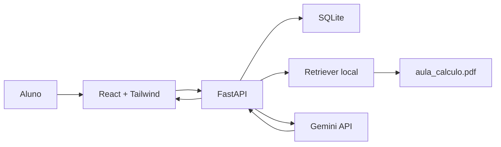

# Consolida Cálculo I

Aplicação de consolidação de aprendizagem para alunos da Cruzeiro do Sul Virtual.
Depois da aula, o aluno informa o nome, responde perguntas guiadas e recebe um
diagnóstico com objetivos dominados, pontos de revisão, recomendações e gráfico
de desempenho. A mensagem principal da IA sempre inclui o nome do aluno.

## Como executar

### Frontend

```bash
pnpm --filter @workspace/case-cruzeiro-do-sul run dev
```

O frontend é React + TypeScript + Tailwind CSS e utiliza a rota `/` do artefato.

### Backend FastAPI

Instale as dependências Python:

```bash
python -m pip install -r artifacts/case-cruzeiro-do-sul/requirements.txt
```

Configure `GEMINI_API_KEY` nos Segredos do Replit. Nunca coloque a chave em
`.env`, no frontend, no Git ou em uma mensagem. O arquivo `.env.example` mostra
somente os nomes das variáveis.

Inicie o backend a partir de `artifacts/case-cruzeiro-do-sul`:

```bash
python backend/main.py
```

As rotas principais são:

- `POST /case-cruzeiro-do-sul-api/evaluations/start`
- `POST /case-cruzeiro-do-sul-api/evaluations/{id}/answers`
- `GET /case-cruzeiro-do-sul-api/evaluations/{id}/diagnostic`

## Dados e RAG

- `data/aula_calculo.pdf` é a cópia de trabalho do material anexado.
- O backend extrai o texto do PDF com PyMuPDF e recupera os parágrafos mais
  relevantes por correspondência de termos antes de chamar o Gemini.
- O Gemini recebe um prompt estruturado e deve responder em JSON.
- As tabelas SQLite guardam alunos, avaliações, perguntas, respostas e
  diagnósticos em `data/consolida_calculo.sqlite3`.

## Arquitetura



## Manutenção do RAG

1. Substitua `data/aula_calculo.pdf` por uma versão revisada da aula.
2. Mantenha o extrator e o recuperador em `backend/main.py`.
3. Se a aula crescer, substitua o ranqueamento simples por chunks com
   identificador, metadados por seção e embeddings em um banco vetorial.
4. Registre um conjunto de perguntas de avaliação e verifique se cada resposta
   pode ser encontrada no PDF.
5. Nunca envie dados sensíveis de alunos no prompt além do necessário para a
   devolutiva.

## Manutenção de fine-tuning

O fine-tuning não é necessário para a primeira versão. Antes de adotá-lo:

1. Colete exemplos revisados por um professor, removendo dados pessoais.
2. Formate pares de instrução, contexto, resposta esperada e justificativa.
3. Separe treino, validação e teste por objetivo de conhecimento.
4. Compare o modelo ajustado com o prompt + RAG usando os mesmos casos.
5. Mantenha o RAG mesmo com fine-tuning: o material da disciplina deve continuar
   sendo a fonte atualizável e verificável.

## Áreas de conhecimento cobertas

Funções e matemática básica, limites, regra de L'Hôpital, derivadas, regra da
cadeia, interpretação física, integrais e multivariáveis como próximos passos,
modelagem de raízes e aplicações em dimensionamento de vigas e cargas.

Desenvolvido pelo candidato João Vitor Belasque.